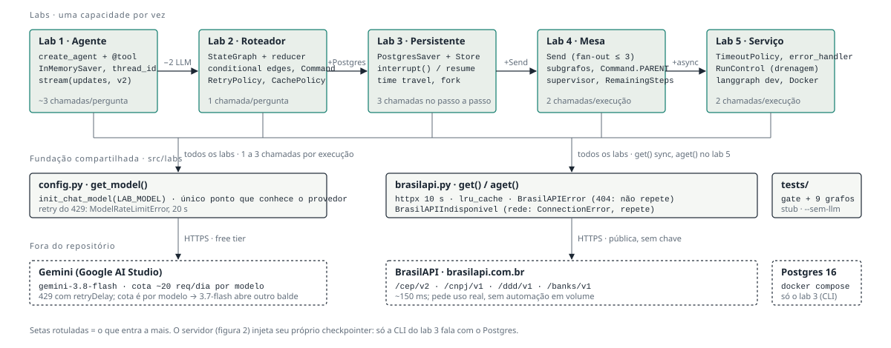
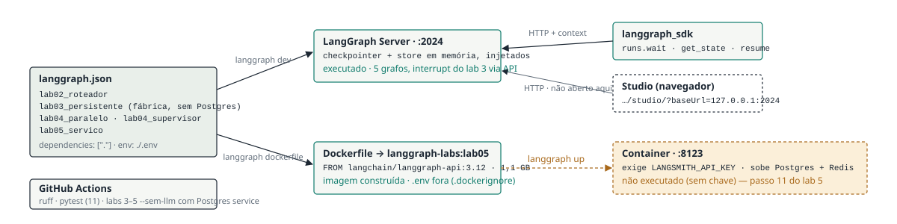

# Laboratorio LangGraph — do basico ao avancado

[](https://github.com/IldeanFreitas/langgraph-labs/actions/workflows/ci.yml)
[](LICENSE)

> **Status: Concluído** — os 5 labs foram executados em 19/09/2026 (labs 3 a 5 com `gemini-3.7-flash`, porque a cota diária do 3.8 acabou no meio do dia). O único passo não executado é subir o container do LangGraph Server, que exige `LANGSMITH_API_KEY` — está marcado como tal no lab 5.

Estudo prático de [LangGraph](https://docs.langchain.com/oss/python/langgraph/overview) 1.2,
construindo agentes e workflows sobre a [BrasilAPI](https://brasilapi.com.br/docs) — API pública,
sem chave. Cada lab isola um conceito e termina em código que roda.

Repositório de aprendizado, não biblioteca. O que está aqui foi executado na máquina; o que ainda
não foi está marcado como tal.

Cinco labs de ~1h, usando a **BrasilAPI** como fonte de dados e o **free tier do Gemini** como modelo.
Custo: **R$ 0**.

## Mapa do projeto

Como os cinco labs se encaixam — cada seta diz o que o lab seguinte acrescenta; a
fundacao em `src/labs` e o unico caminho para o modelo e para a BrasilAPI:



Como o grafo vira servico no lab 5 — o que esta tracejado em ambar existe, mas nao foi
executado (exige `LANGSMITH_API_KEY`):



Versao navegavel, com a tabela de estado e pendencias: [docs/mapa.html](docs/mapa.html).

## Stack (versoes verificadas em 19/set/2026)

| Camada | Pacote | Versao |
|---|---|---|
| Framework | `langgraph` | 1.2.11 |
| Agente + middleware | `langchain` | 1.4.2 |
| Modelo | `langchain-google-genai` | 4.4.0 |
| Checkpointer (lab 3+) | `langgraph-checkpoint-postgres` | 3.1.2 |
| Dev server | `langgraph-cli[inmem]` | 0.4.31 |

Ambiente: Windows + Python 3.12 + `uv`, sem WSL. Docker Desktop roda o Postgres
(lab 3) e constroi a imagem do LangGraph Server (lab 5) — o build funcionou
direto do Windows, WSL nao foi necessario.

## Setup (uma vez)

1. Instale o `uv`:
   ```powershell
   powershell -ExecutionPolicy ByPass -c "irm https://astral.sh/uv/install.ps1 | iex"
   ```
   **Esperado:** `uv --version` responde.

2. Crie o ambiente e instale:
   ```powershell
   cd D:\Portifolio\LangGraph\labs
   uv sync
   ```
   **Esperado:** pasta `.venv` criada e `uv run python -c "import langgraph; print(langgraph.__version__)"` imprime 1.2.x.

3. Pegue a chave do Gemini em https://aistudio.google.com/apikey (free tier, sem cartao).
   Confira seus limites reais em https://aistudio.google.com/rate-limit — o Google passou a
   mostrar RPM/TPM/RPD por conta, nao mais numa tabela publica fixa.

4. Copie `.env.example` para `.env` e preencha `GOOGLE_API_KEY`.

5. Valide a BrasilAPI antes de qualquer codigo de agente:
   - abra `requests.http` no VS Code e rode os 8 blocos (extensao REST Client), ou
   - ```powershell
     uv run pytest tests/test_brasilapi.py -v
     ```
   **Esperado:** 2 testes passando. Se falhar aqui, o problema e rede/API — nao e LangGraph.

6. Postgres (so a partir do lab 3):
   ```powershell
   docker compose up -d
   ```
   **Esperado:** `docker compose ps` mostra `langgraph-labs-pg` como `healthy`.

## Os labs

| # | Tema | Conceitos | Entrega |
|---|---|---|---|
| 1 | Primeiro agente com ferramenta real | tool calling, estado de mensagens, `InMemorySaver`, `thread_id`, streaming | consulta de CEP conversacional |
| 2 | Graph API: estado, reducers, roteamento | `TypedDict` + `Annotated`, `Command`, `context_schema`/`Runtime`, `RetryPolicy`, cache de no | roteador deterministico (1 chamada de LLM) |
| 3 | Persistencia e aprovacao humana | `PostgresSaver`, `durability`, `Store`, `interrupt()`, time travel | agente que sobrevive ao restart |
| 4 | Paralelismo e multi-agente | `Send`, supervisor, `Command.PARENT`, subgrafos, streaming aninhado | mesa de consultas com relatorio |
| 5 | Producao | nos async, `TimeoutPolicy`, `error_handler`, `RunControl`, `langgraph.json` + `langgraph dev`, SDK, testes com stub, `langgraph dockerfile` | os 5 grafos como servico REST + Studio, com imagem Docker |

Cada lab vive em sua propria pasta (`lab01/` ... `lab05/`) e reaproveita `src/labs/`.
Compare o lab 2 com o lab 1: e a melhor aula de quando **nao** usar agente.

## Regras da casa

- Nenhum lab importa o SDK do provedor direto. Trocar de modelo = trocar `LAB_MODEL` no `.env`.
- Toda chamada externa passa por `labs/brasilapi.py`, que tem cache e trata erro.
- `recursion_limit` explicito em todo grafo (10 a 15 nos labs).
- Segredo nunca entra no estado do grafo — o estado e persistido no Postgres.

## Fontes

- Guias: https://docs.langchain.com/oss/python/langgraph/overview
- API: https://reference.langchain.com/python/langgraph/
- BrasilAPI: https://brasilapi.com.br/docs

## CI

Cada push na `main` roda lint (`ruff`), o gate da BrasilAPI e os labs 3 e 4 com
`--sem-llm` — a mecânica (Postgres, `interrupt()`, `Send`, subgrafos) é provada sem
gastar cota de modelo nem expor chave. Ver [.github/workflows/ci.yml](.github/workflows/ci.yml).

## Licença

[MIT](LICENSE).
